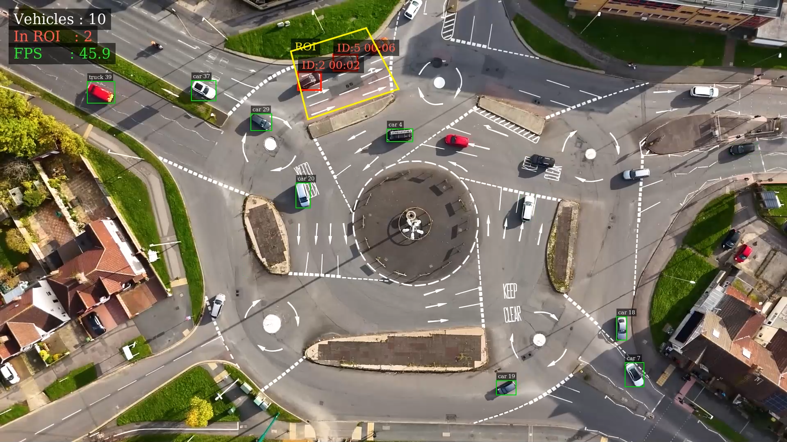
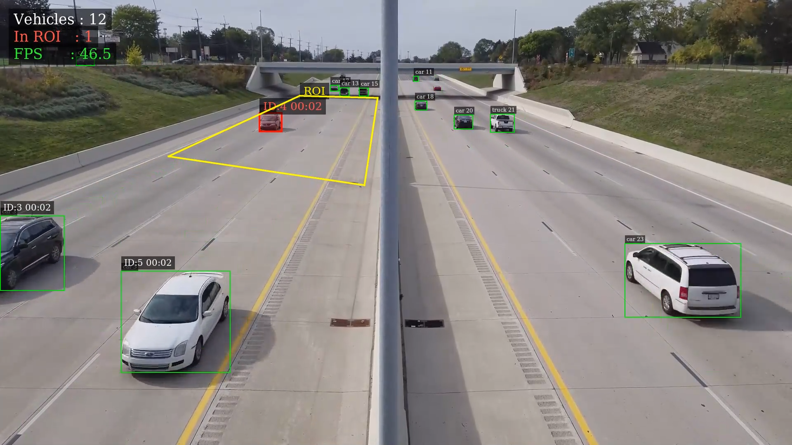

# ROI & MOT DeepStream Application

This package contains a Dockerized NVIDIA DeepStream 8.0 application that performs Object Detection, Multi-Object Tracking (MOT), and Region of Interest (ROI) analysis. It leverages custom YOLO implementations to detect vehicles, tracks their movement across frames, and computes the "Dwell Time" (time spent) for each vehicle entering a predefined ROI polygon.

## Demonstrations

<video src="https://github.com/user-attachments/assets/6ac98dd6-122c-4ea3-9345-97111ea97e53" controls="controls" muted="muted" autoplay="autoplay" loop="loop" style="max-width: 100%;"></video>

<p align="center">
  
  

</p>
*Left: Region of Interest (ROI) monitoring and Dwell Time tracking. Right: Vehicle tracking.*

## Features

- **YOLO Object Detection**: Utilizes `nvinfer` with a custom YOLO plugin (`libnvdsinfer_custom_impl_Yolo.so`).
- **Multi-Object Tracking (MOT)**: Employs `nvtracker` for persistent vehicle tracking across frames.
- **Dynamic ROI Monitoring**: Dynamically loads ROI polygons mapped to specific input video files using `configs/roi_config.json`.
- **Dwell Time Tracking**: Accurately calculates and displays the time each vehicle spends inside the designated ROI.
- **On-Screen Display (OSD) HUD**: Real-time overlay showing overall FPS, Total Vehicles detected, and the count of Vehicles currently inside the ROI.

## Requirements

1. Docker installed on the host machine.
2. NVIDIA GPU and NVIDIA Container Toolkit installed.
3. (Optional but recommended) Docker Compose.

## How to Build and Run

### Using Docker Compose (Recommended)

To build the Docker image (which automatically compiles the application using `build_tasks.sh`), run:

```bash
docker compose build
```

Launch the interactive container with GPU support and X11 forwarding enabled (allowing you to view visual outputs like video screens if needed):

```bash
./run.sh
```

### Running the Application

Inside the interactive container shell, you can run the compiled DeepStream application:

```bash
cd build
./deepstream_gst_app [input_video] [output_video] [roi_config]
```

**Example:**
```bash
./deepstream_gst_app ../input/input.mp4 ../output/result.mp4 ../configs/roi_config.json
```

**Note:** If an application requires command-line arguments (like passing an input video file), append them to the execution command. By default, it runs on `../input/input.mp4` and saves the output to `../output/result.mp4`.
